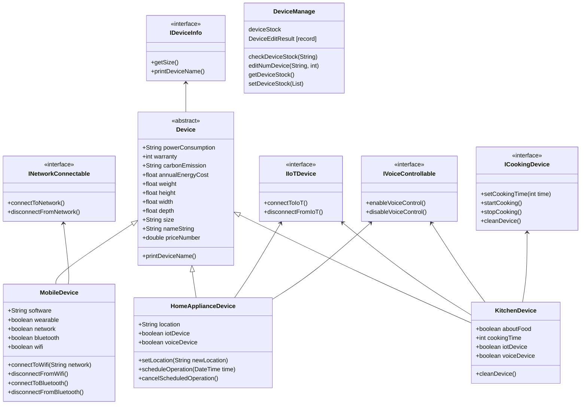
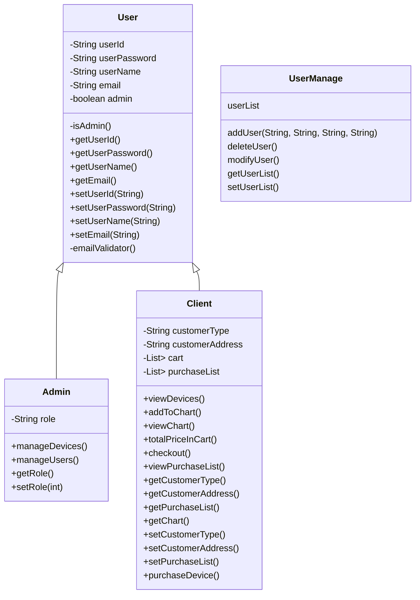
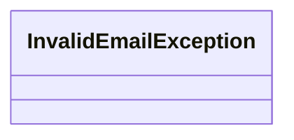

# 전자기기 상품 구매 관리

구매장와 매니저를 지정하여 물품들을 콘솔(로그인)로 구매 및 관리

# Device Diagram

## User Diagram

## User defined Exception

## 역할분담

- 박수아
  - ICookingDevice
  - IDeviceInfo
  - IIoTDevice
  - INetworkConnectable
  - IVoiceControllable
- 민정현
  - User
  - Admin
  - Client
  - DeviceManage
  - UserManage
- 배성훈
  - Device
  - MobileDevice
  - HomeApplianceDevice
  - KitchenDevice

# TODO

- [x] 클래스 다이어그램 작성
- [x] 로그인 기능 구현
- [x] 장바구니 제품 추가
  - [x] DeviceManage
- [x] 장바구니 리스트
  - [x] DeviceManage
- [x] 장바구니 전체 가격
  - [x] DeviceManage
- [x] 잔여 수량
  - [x] DeviceManage
- [ ] 제품 입고
- [ ] 유저 추가
- [ ] 유저 삭제
- [ ] 유저 수정
- [ ] 구매 이력
