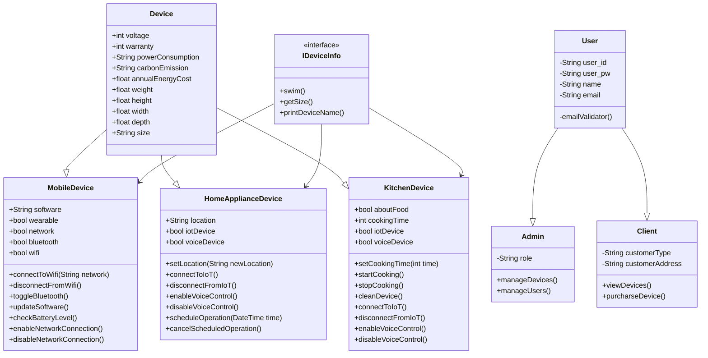
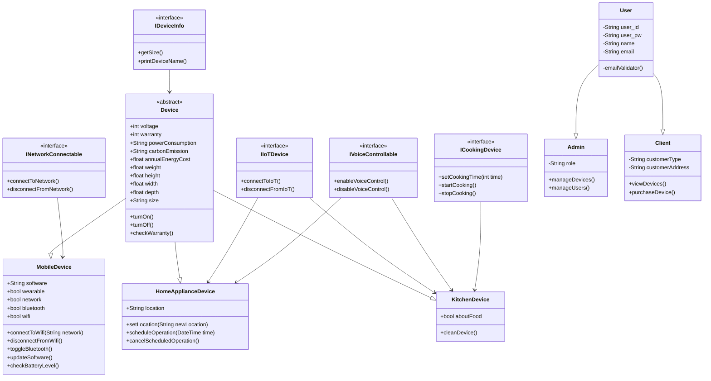

# Class Diagram

# Optimized Class Diagram

## 역할분담

- 박수아
  - [ ] ICookingDevice
  - [ ] IDeviceInfo
  - [ ] IIoTDevice
  - [ ] INetworkConnectable
  - [ ] IVoiceControllable
- 민정현
  - [ ] User
  - [ ] Admin
  - [ ] Client
- 배성훈
  - [ ] Device
  - [ ] MobileDevice
  - [ ] HomeApplianceDevice
  - [ ] KitchenDevice
