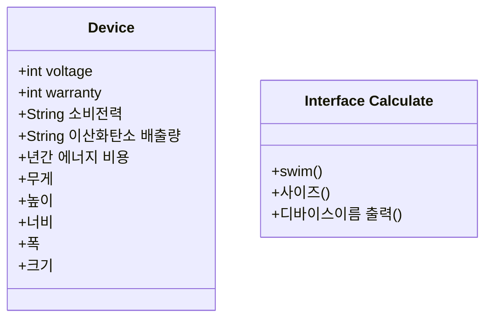

도메인:
가전제품 쇼핑몰

- 주방
  - 냉장고
  - 밥솥
  - 커피머신
  - 식기세척기
  - 정수기
  - 오븐
  - 전자레인지
  - 에어프라이어
  - 믹서기
  - 토스터
  - 전기포트
  - 인덕션
- 생활
  - 건조기
  - 세탁기
  - 청소기
  - 공기청정기
  - 제습기
  - 가습기
  - 에어컨
  - 선풍기
  - 전기담요
  - 다리미
- 모바일 기기
  - 스마트폰
  - 태블릿
  - 노트북
  - 스마트워치
  - 무선이어폰
  - 보조배터리
  - e-북 리더기
  - 휴대용 게임기

넣어야 할것들

- 조건문 반복문
- 상속
- 인터페이스
- 해시맵
- @Getter @Setter
- 다형성
- 익명 객체
- 예외 처리
- 제네릭

